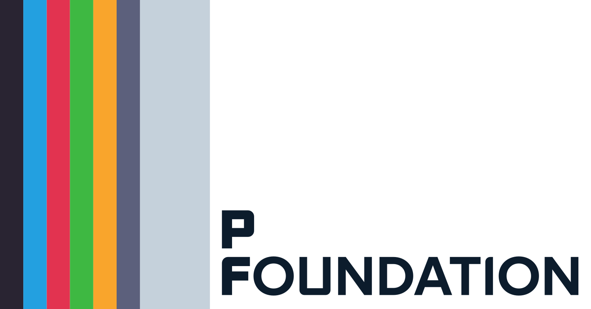

<p align="center">
 
</p>

# P Foundation

**Empowering nations with open internet and free journalism.**

P Foundation is a 501(c)(3) non-profit corporation registered in Washington, DC, dedicated to bridging the digital divide and promoting open access to information worldwide. Established in 2021, we serve the global community with a focused commitment to the Middle East and Lebanon, where the need for open internet and free journalism is crucial.

## Our Mission

At the core of our foundation lies the ethos that an open internet and free journalism form the backbone of every progressive nation, binding societies with threads of transparency, accountability, and uninhibited expression. We envision a world where every individual, irrespective of their location or background, has unhindered access to the vast reservoirs of knowledge and information the internet has to offer.

## Our Values

Our work is guided by four core principles:

- **Patriotism**: We fuel our drive to serve the nations we operate in, ensuring that the benefits of our efforts are felt at every grassroots level.
- **Passion**: Our passion for an open internet propels us forward, driving us to challenge the status quo and break down barriers.
- **Persistence**: This helps us overcome challenges, ensuring that we remain committed to our goals no matter the hurdles.
- **Partnership**: Our belief in global partnerships stems from understanding that collaborative efforts amplify impact. By forging alliances with like-minded entities, we strive to achieve collective success that benefits all.

## Background & Rationale

The P Foundation emerged from a profound belief in the power of media and the transformative capabilities of technology. Founded during a period of significant challenges in the Middle East, particularly in Lebanon where internet access had become a political bargaining chip and infrastructure was crumbling, we recognized the urgent need for sustainable solutions.

Our founder's journey from developer to media professional, combined with exposure to newsrooms and understanding of both technical and communications challenges, laid the foundation for our comprehensive approach to digital empowerment.

## Current Programs

### MediaGuard

Designed to bolster media organizations globally, MediaGuard extends tailored support ensuring they maintain a consistent and uninterrupted media presence. Services include backhaul support, downlinking, digital streaming, and content distribution.

**Contact**: mediaguard@p.foundation

### CitizenMesh

A community-led initiative that empowers communities to build and maintain their own reliable internet connections. We focus on key communal spaces such as educational institutions, public libraries, and public spaces, offering free internet access as a cornerstone for enhancing public life.

**Contact**: cmp@p.foundation

### ResilientNet

A specialized extension of CitizenMesh aimed at providing robust internet connectivity to critical installations essential for public well-being, including healthcare institutions, emergency services, and utility facilities.

## Future Plans & Roadmap to 2027

Our strategic goals include:

### Expanding Partnerships

Increasing the number of beneficiaries by adding more organizations to our MediaGuard initiative, offering personalized support and dedicated points of contact for smoother transitions.

### Strengthening Citizen-Focused Programs

Deepening partnerships with organizations that have significant grassroots experience and direct impact on citizens' lives, providing enhanced tools and support.

### Forward Deployed Software Engineer Model

Developing a structured program to train software engineers in rapid problem-solving and effective integration, addressing the talent gap in the Middle East.

### Program Enhancement

Leveraging advancements in machine learning and technology to accelerate development processes and introduce new functionalities to better serve our partners.

## Key Contributors & Leadership

- **Jud**: Founder and primary architect of the foundation's vision and strategy
- Our dedicated team of volunteers who employ systematic approaches to assess connectivity needs and expand services
- Various partner organizations and stakeholders who collaborate on initiatives

## Documentation & References

- [Roadmap to 2027](./messages/2024-03-31-roadmap_to_2027.md) - Our strategic vision and goals
- [Code of Conduct](./src/pages/coc.md) - Our principles and standards
- [Foundation Website](https://p.foundation) - Complete information about our work
- [AS399728 Network Information](https://p.foundation/as399728) - Our network peering details

## Getting Involved

We welcome contributions from external stakeholders and the community at large. Whether you're a media organization seeking support, a community looking for connectivity solutions, or an individual interested in our mission, we encourage you to reach out.

For general inquiries: [Contact us through our website](https://p.foundation)

---

## Development

This website is built using [Docusaurus 2](https://docusaurus.io/), a modern static website generator.

### Installation

```bash
npm install
```

### Local Development

```bash
npm start
```

This command starts a local development server and opens up a browser window. Most changes are reflected live without having to restart the server.

### Build

```bash
npm run build
```

This command generates static content into the `build` directory and can be served using any static contents hosting service.

### Testing

```bash
npm run lint
npm run typecheck
```

### Deployment

This site is deployed automatically from the `main` branch using [Cloudflare Pages](https://pages.cloudflare.com/).

---

_Together, as we navigate the challenges and opportunities of the digital age, the P Foundation stands as a beacon of hope, dedication, and unwavering commitment to a brighter, more informed, and interconnected world._
